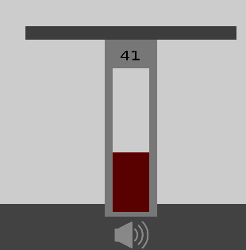

# VolumeControl
Playfully change your sound volume.





## Requirement
you will need java between java8 and java20

## Build
Run this command to build

For linux
```
make
```

For Windows use gradlew.bat

## Execute
jars to open gui


```
java -jar pumpControl/LibGDX/desktop/build/libs/desktop-1.0.jar
```


```
java -jar speakerControl/desktop/build/libs/desktop-1.0.jar
```

